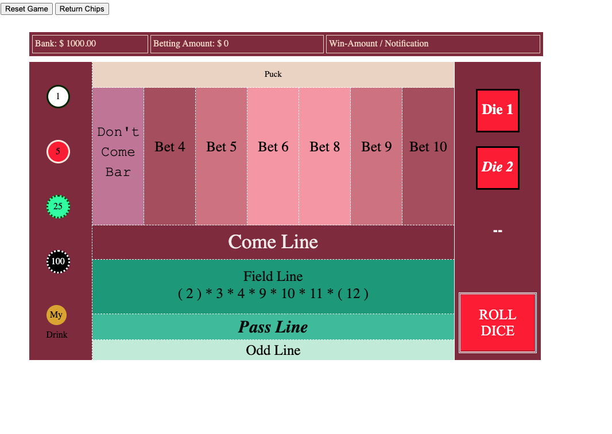
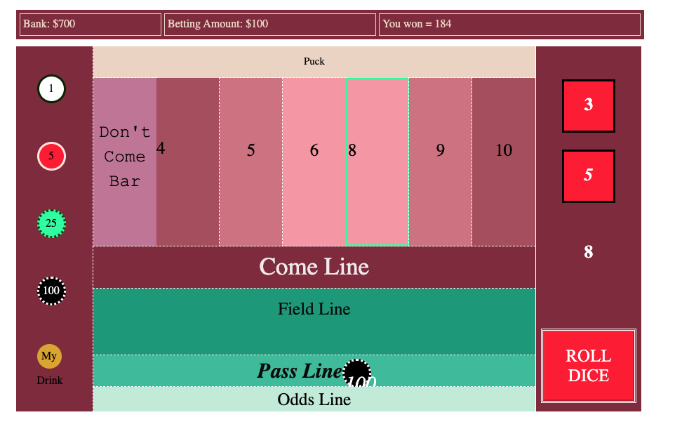

# Craps

### Project Information
Learning and building a functional game of Craps.

### Technologies Used
HTML, CSS, Vanilla JS

# Link
## https://sparkly-platypus.netlify.app

#### Background
First project for General Assembly. From a list of game choices I have decided to build craps because I've always wanted to learn how to play craps.
###### Time line
4 days

#### Introduction to Craps and Approach Taken:
##### How to Play:
Craps is a casino dice game - a game of change and percentages. To understand the game we must first look at the odds of rolling a certain number:
| Dice Value | Combinations | Odds of Rolling
| ----- | ----- | ----- |
| 2 | 1-1         |   1/36 |
| 3 | 1-1, 2-1     | 2/36 
| 4 | 1-3, 3-1, 2-2     | 3/36
| 5 | 1-4, 4-1, 2-3, 3-2  | 4/36
| 6 | 1-5, 5-1, 2-4, 4-2, 3-3 |  5/36
| 7 | 1-6, 6-1, 2-5, 5-2, 3-4, 4-3 | 6/36
| 8 | 2-6, 6-2, 3-5, 5-3, 4-4 | 5/36
| 9 | 3-6, 6-3, 4-5, 5-4 | 4/36
| 10 | 4-6, 6-4, 5-5 | 3/26
| 11 | 5-6, 6-5 | 2/36
| 12 | 6-6 | 1/36

As we can see from above, with two dice, it is more likely that we will roll a seven and the game of Craps is built on this percentage. This game is conventionally played in turns, rotating clockwise - at the end of ones turn (called "Seven Out" but be careful! We do **not** use the word "seven" at a craps table!)(Instead we say The-Number-Who-Must-Not-Be-Said or "Big Red").

There are many different available bets, this is not a complete game of craps but a simplified version, having only the basic and most commonly played bets. Once you understand this basics of craps, there are many higher level stategies you can employ. 

To start a game of Craps, the dice roller must first bet on the Pass Line.
On your first roll, called the Come Out Roll, if you hit a 7 or 11 (8/36 or 2/9 chance!) you win, your Pass Line Bet @ 1:1.
If you roll 2, 3, or 12 (4/36 or 1/9) on your Come Out Roll, you lose and your turn is over.
If you roll the other numbers (4, 5, 6, 8, 9 , 10) - that number becomes your Point number.

Now we are into our Point Rolls. Once your point number becomes established, you will win your Pass Line Bet if you roll your Point  Number. \
Between your rolls - you can also place bets on individual numbers, and win if you roll those numbers. \
There are other bets as well as Odds Bet and Fields Bet. The Odds Bet is similiar to the Pass Line. 
You win, if you roll your Point Number like the Pass Line.
For Fields Bet, you win if you roll either a 2,3,4,9,10,11,12 - (this is a one time bet - need to fix!)
YOU LOSE ALL BETS IF YOU ROLL A 7. 
You may have noticed that 7 is the most common roll to number.
On our first turn its good but after the first roll, the odds are against us!

Craps is a community game, as in, during your turn, in between rolls, the other players will bet on pass line, numbers, different odds with you. When you "Seven Out" the players will lose their bets with you and when you roll other numbers, they will win with you. If you have a hankering for a good time, go to your local casino, and enjoy!

##### Payout Odds:
.
|*for PASS LINE* | |  |   |
| --- | --- | --- |--- |
| Bet or Wager | True Odds | Payout Odds | House Edge |
| Pass Line/ Come Bet | 251 to 244 | 1:1 | 1.414% |

|*for ODDS pass LINE* | |  |   |
| --- | --- | --- |--- |
| Bet or Wager | True Odds | Payout Odds | House Edge |
| 4 or 10 | 2 to 1 | 2:1 | 4.76% |
| 5 or 9 | 3 to 2 | 3:2 | 4.76% |
| 6 or 8 | 5 to 6 | 5:6 | 4.76% |

Field bet inaccurate - since it's **NOT** a one time bet in my game..
|*FIELD BET* |  |  |   |
| --- | --- | --- |--- |
| Bet or Wager | True Odds | Payout Odds | House Edge |
| 3, 4, 9, 10 or 11 | - | 1:1 | 5.5% |
| 2 or 12 | - | 2:1 | 5.5% |

|*PLACE BETS* |  |  |   |
| --- | --- | --- |--- |
| Bet or Wager | True Odds | Payout Odds | House Edge |
| 4 or 10 | 2 to 1 | 9:5 | 6.7% |
| 5 or 9 | 3 to 2 | 7:5 | 4.0% |
| 6 or 8 | 6 to 5 | 7:6 | 1.52% |

### Approach:

The difficulty of programming a game of craps is
(1) the enormous amount of betting possibilities, which all have different rules, and payout percentages
(1.5) certain bets can be played, won and lost, without the turn being over/ without having to "reset" the turn
(2) having two parts of the game, the Come Out roll and the Point Roll, which require two different game logic and pay out algorithms

None of these are difficult per say but the difficulty lies in the getting all of the smaller gears to work together as a whole.

What other way is there to approach this than to take it logically, step by step?
1) Roll Dice - if you hit 7 or 11, you win - if you hit 2 3 or 12, you lose
2) If not win or lose - move onto Point Turn 

#### Proof of concept
I initially created a layout to see if the basics would work - a proof of concept.
It had:
A button for Roll Dice and Total Dice Roll Results.
A button for Pass Line Bet - if you clicked it - it displayed += 5 incremenets to signify your bet
If winnings numbers came out, displayed you won
If losing numbers came out, displayed loss

#### Approach (cont.)
Once on point turn, had to establish new winning number and game play.
To keep it simple, I highlighted the box the new point new is.
1) If you roll 7 you lose
2) If you roll winning number you win
3) If you roll other numbers - continue

#### Workflow:
- Learned Craps/ YouTube/ Articles/ Online Craps Game
- Created Psuedo Code
- Created Proof of Concept with basic HTML/ JS
- Created a basic HTML/ CS / JS structure of code that I will most likely use
- Created JS
- As I furthered developed the game from Proof of Concept to a fully functional, multipart, whole, game ->
- Alternated between HTML/ CS / and JS (more CS needed for more JS vice versa)
- After JS and game functionally was complete, worked on polishing up CSS
- Completing this ReadMe.. v1

### What went well
(1) Learned the basics of Drag and Drop API. Although we are not covering APIs till 2 weeks later, I wanted the feature/ ability where you can drag and drop poker chips. An alternative to not having this work would have been to add (*sliders(?)) up & down arrow buttons to increase chip bet on all individual betting areas.
(1.1) Giving and transferring values from poker chip to target betting area to be able to used in JS
(1.2) Clearing chips / resetting bets

### Hurdles
(1) No major hurdles although there are more things to learn and debug
(2) On the spot, I'd say I'd like to clean up the drag and drop.

Check out MD Files - issues, notes, and optimizations are documented.

### Future features
(1) Want to create the Side Bets/ and One Time Bet squares as well as Craps and Elevens Bet
(2) Complete Come Line Feature, understand No Pass Line and other betting squares and create these bets as well
(3) Moving dice animation
(4) CSS - poker table, black diamond border, and a wood border around the black foam craps wall

More issues, notes, todos, and optimizations are organized and documented in MD Files in this repo.
Check out MD Files - issues, notes, and optimizations are documented.

## What I've learned
(1) After completion of all the algorithms needed for game flow, I see how I can optimize my code. Creating object with multiple key-value pairs and having all the Objects in the array to loop over / or creating a new Class (need to think about this more.. by having multiple objects, I can code in individual bet odds/ winning percentage as a function since all numbers have a different pay out).

